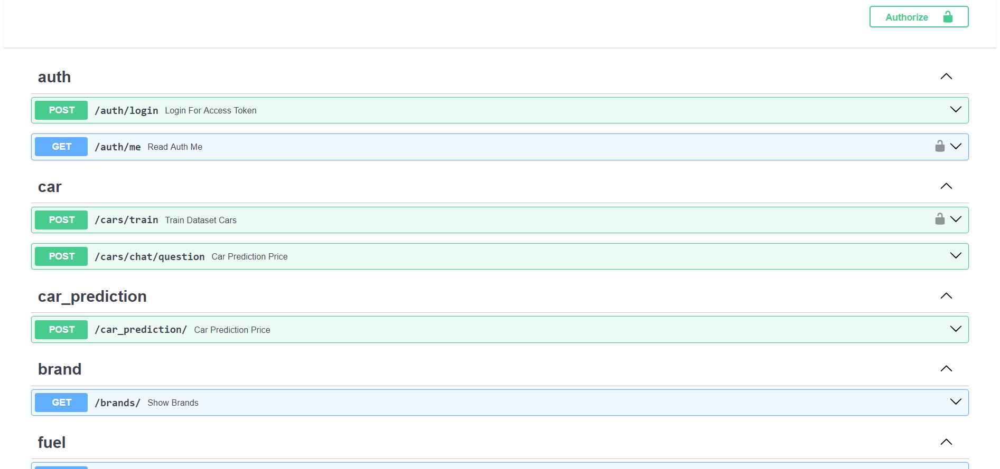

  

Application that implements an API in <b>Python</b> using the <b>FastAPI</b> framework, designed to predict car prices based on their characteristics, such as brand, model, mileage, among others. The machine learning model has been trained with a data set of more than 50,000 cars, allowing it to generate accurate and reliable price estimates.

In addition, the application includes a <b>RAG (Retriever-Augmented Generation)</b> as a virtual assistant, which helps users obtain information about cars and their characteristics in an interactive way. Additionally, it has an <b>authentication system so that administrator users</b> can retrain the model with new data, uploaded via CSV files.

---

<h3>Features</h3>

<ul>
<li><b>Price Prediction:</b> The model predicts the price of cars based on characteristics such as make, model, mileage, etc.
</li>
<ul>
<li>In addition to the estimated price, the API returns a list of related cars, based on the characteristics entered by the user.</li>
</ul>

<li><b>Model Retraining:</b> The system includes an authentication system so that administrators can upload new data via a CSV file, allowing the machine learning model to be retrained with updated information.</li>

<li><b>RAG Virtual Assistant:</b> An intelligent assistant that answers questions related to cars and their specifications.</li>

<li><b>Fast and Scalable API:</b> Developed with FastAPI, guaranteeing high performance and fast response times.</li>
</ul>

<h3>Functionalities</h3>

<h4>Machine Learning & RAG</h4>
<ul>
  <li><strong>TensorFlow</strong>: Framework to create and train <strong>Machine Learning</strong> models, used for car price prediction.</li>
  <li><strong>Scikit-learn</strong>: Library for creating statistical and machine learning models, complementing TensorFlow.</li>
  <li><strong>Pandas</strong>: Data manipulation library, essential for preprocessing and analyzing data for price prediction.</li>
  <li><strong>NumPy</strong>: Numerical computations and efficient management of multidimensional arrays, useful for preparing model input data.</li>
  <li><strong>Langchain</strong>: Framework for building applications that integrate <strong>Chain-of-Thought</strong> (RAG), used in the virtual assistant to provide car-related answers based on data.</li>
  <li><strong>Sentence-transformers</strong>: Models to generate vector representations of text, useful for the RAG system that improves assistant responses.</li>
  <li><strong>Ollama</strong>: Integration of large language models (LLM) to enhance the virtual assistant's processing capability.</li>
</ul>

<h4>API & Security</h4>
<ul>
  <li><strong>FastAPI</strong>: Framework for building the API quickly and efficiently, with support for automatic documentation generation.</li>
  <li><strong>PyJWT</strong>: Authentication based on <strong>JWT</strong> (JSON Web Tokens), enabling session token generation and validation.</li>
  <li><strong>Passlib (bcrypt)</strong>: Secure password management, using bcrypt for secure password storage.</li>
  <li><strong>SlowAPI</strong>: Rate limiting implementation in the API to prevent abuse and protect resources.</li>
  <li><strong>python-dotenv</strong>: Management of environment variables, facilitating secure configuration and credential handling.</li>
  <li><strong>Python-Multipart</strong>: Handling file uploads in HTTP requests (e.g., CSV files for model retraining).</li>
  <li><strong>Aiofiles</strong>: Asynchronous file reading and writing, improving API performance when handling large files efficiently.</li>
  <li><strong>Requests Validations</strong>: Validation of data received in HTTP requests to ensure correct parameters are provided.</li>
</ul>

<h4>Database & ORM</h4>
<ul>
  <li><strong>SQLAlchemy</strong>: ORM to interact with databases, managing relationships between data in a simple manner.</li>
  <li><strong>PyMySQL</strong>: Connector for MySQL databases, used to interact with the application database.</li>
  <li><strong>Pydantic</strong>: Validation and management of data through models, ensuring correct input and output.</li>
  <li><strong>Automatic Table Migration</strong>: Automatic migrations for all database tables, simplifying schema management.</li>
  <li><strong>Seeders in JSON format</strong>: <strong>JSON</strong> files used to populate the database with initial data.</li>
</ul>

<h4>File Storage</h4>
<ul>
  <li><strong>File Storage with Pickle</strong>: File persistence using the <strong>Pickle</strong> library to store the model, scalers, encoders, and normalized data.</li>
  <li><strong>ChromaDB with Persistence</strong>: <strong>ChromaDB</strong> has persistence by saving embedding files in storage, allowing data retrieval over time.</li>
</ul>

<h4>Containerization & Deployment</h4>
<ul>
  <li><strong>Docker</strong>: The application includes files for deployment in <strong>Docker</strong>, making it easier to containerize and deploy across different environments.</li>
</ul>

<h4>Other Features</h4>
<ul>
  <li><strong>Websockets for Training Progress</strong>: Uses <strong>websockets</strong> to show real-time training progress of the model.</li>
  <li><strong>Postman Collection</strong>: Includes a <strong>Postman</strong> file with all the <strong>endpoints</strong> of the API, allowing easy import and testing of application functionalities.</li>
  <li><strong>Enums</strong>: Use of <strong>Enums</strong> in the application to define constant values clearly and simply.</li>
  <li><strong>Exception Handling</strong>: A robust exception handling system implemented in the API to ensure appropriate responses in case of errors.</li>
</ul>

<h4>Technology</h4>
<ul>
  <li><strong>Python 3.12</strong>: The application is developed using <strong>Python 3.12</strong>, taking advantage of the new features and improvements of the language.</li>
</ul>

<h3>Prerequisites</h3>

Before running the application, ensure that you have the following installed:

<ul>
	<li><b>Python 3.12</b> - Ensure you have Python version 3.12 installed.</li>
  <li><b>SQL Database</b> - MySQL or MariaDB is required to store application data.</li>
  <li><b>Ollama</b> - LLM used for chatbot functionality. You can download it from <a href="https://ollama.com" target="_blank">Ollama's website</a>.</li>
  <li><b>Llama3</b> - Another dependency for large language model functionalities.</li>
  <li><b>GPU (Graphics Card)</b> - For running large language models (LLMs), a compatible GPU is required for optimal performance. Ensure that your system is equipped with a supported GPU and the necessary drivers installed (e.g., CUDA for NVIDIA GPUs).</li>
</ul>

<h3>Setup</h3>
<pre>
<code>git clone https://github.com/JAVI-CC/python-api-CarPriceAI.git</code>
</pre>
<pre>
<code>cd python-api-CarPriceAI</code>
</pre>
<pre>
<code>cp .env.example .env</code>
</pre>
<pre>
<code>pip install --no-cache-dir --upgrade -r requirements.txt</code>
</pre>
<pre>
<code>pip install --upgrade requests && pip install --upgrade six</code>
</pre>
<pre>
<code>fastapi run app/main.py --port 8000 --reload</code>
</pre>
<pre>
<code>sed -i '/JWT_SECRET_KEY=""/d' .env.dev && jwt_secret_key="JWT_SECRET_KEY=$(openssl rand -hex 32)" && sed -i -e "11i$jwt_secret_key" .env.dev</code>
</pre>
<pre>
<code>python -m app.db.migration</code>
</pre>

<h3>API documentation summary</h3>

User: <b>admin@email.com</b> 
Password: <b>Pass-1234</b>

<h4>Headers</h4>
<table>
<thead>
<tr>
<th>Key</th>
<th>Value</th>
</tr>
</thead>
<tbody>
<tr>
<td>Authorization</td>
<td>{Token provided by JWT}</td>
</tr>
<tr>
<td>Accept</td>
<td>application/json</td>
</tr>
</tbody>
</table>

<h4>Endpoints Auth:</h4>
<table>
<thead>
<tr>
<th>Method</th>
<th>Path</th>
<th>Description</th>
<th>Auth</th>
</tr>
</thead>
<tbody>
<tr>
<td>POST</td>
<td>/auth/login</td>
<td>Login a user</td>
<td>No</td>
</tr>
<tr>
<td>GET</td>
<td>/auth/me</td>
<td>Check if user authenticated</td>
<td>Yes</td>
</tr>
</tbody>
</table>

<h4>Endpoints Cars:</h4>
<table>
<thead>
<tr>
<th>Method</th>
<th>Path</th>
<th>Description</th>
<th>Auth</th>
</tr>
</thead>
<tbody>
<tr>
<td>POST</td>
<td>/cars/train</td>
<td>Train dataset cars</td>
<td>Yes</td>
</tr>
<tr>
<td>POST</td>
<td>/cars/chat/question</td>
<td>Ask and the chatbot answers</td>
<td>No</td>
</tr>
<tr>
<td>POST</td>
<td>/car_prediction</td>
<td>Car prediction price and cars related</td>
<td>No</td>
</tr>
<tr>
<td>GET</td>
<td>/brands</td>
<td>Show all brands</td>
<td>No</td>
</tr>
<tr>
<td>GET</td>
<td>/fuels</td>
<td>Show all fuels</td>
<td>No</td>
</tr>
<tr>
<td>GET</td>
<td>/transmissions</td>
<td>Show all transmissions</td>
<td>No</td>
</tr>
<tr>
<td>GET</td>
<td>/colors</td>
<td>Show all colors</td>
<td>No</td>
</tr>
</tbody>
</table>

 More information API documentation: <a href="http://localhost:8000/docs" target="_blank">http://localhost:8000/docs</a>

<h3>Configure values in the .env file</h3>

<pre><code>
<strong>DB_DRIVER=""</strong>
<strong>DB_HOST=""</strong>
<strong>DB_PORT=""</strong>
<strong>DB_DATABASE=""</strong>
<strong>DB_USERNAME=""</strong>
<strong>DB_PASSWORD=""</strong>
</code></pre>

<pre><code>
# command generate JWT_SECRET_KEY: openssl rand -hex 32
<strong>JWT_SECRET_KEY=""</strong>
<strong>JWT_ALGORITHM="HS256"</strong>
</code></pre>

<pre><code>
<strong>TIMEZONE=""</strong>
</code></pre>

<pre><code>
<strong>BASE_URL_OLLAMA="http://localhost:11434"</strong>
</code></pre>

<h3>Deploy to Docker <g-emoji class="g-emoji" alias="whale" fallback-src="https://github.githubassets.com/images/icons/emoji/unicode/1f433.png">🐳</g-emoji></h3>

Docker repository: <a href="https://hub.docker.com/r/javi98/python-api-car-price-ai" target="_blank">https://hub.docker.com/r/javi98/python-api-car-price-ai</a>

<h4>Containers:</h4>
<ul>
<li>nvidia/cuda:11.8.0-cudnn8-devel-ubuntu20.04 - <code>:8000</code></li>
<li>ollama/ollama:0.5.12 - <code>:11434</code>
<li>mariadb:11.6.2 - <code>:3306</code></li>
<li>phpmyadmin:5.2.2 - <code>:8085->80/tcp</code></li>
</ul>

<h4>Containers structure:</h4>

<pre>├── python-api-car-price-ai-app
├── python-api-car-price-ai-ollama
├── python-api-car-price-ai-db
└── python-api-car-price-ai-phpmyadmin</pre>

<h4>Setup:</h4>
<pre>
<code>git clone https://github.com/JAVI-CC/python-api-CarPriceAI.git</pre></code>
<pre><code>cd python-api-CarPriceAI</pre></code>
<pre><code>cp .env.example .env</pre></code>
<pre><code>docker compose up -d</pre></code>
<pre><code>docker compose exec ollama chmod +x ./docker-config/first_start_ollama.sh</pre></code>
<pre><code>docker compose exec ollama ./first_start_ollma.sh</pre></code>
<pre><code>docker compose exec app chmod +x ./docker-config/run.sh</pre></code>
<pre><code>docker compose exec app ./docker-config/run.sh</code>
</pre>

Once you have the containers deployed, you can access the API at  <a href="http://localhost:8000" target="_blank">http://localhost:8000</a>

<h4>License </h4>
<strong>JAVI-CC</strong> - CarPriceAI (2025)
License MIT. [LICENSE.txt](LICENSE.txt) for more details